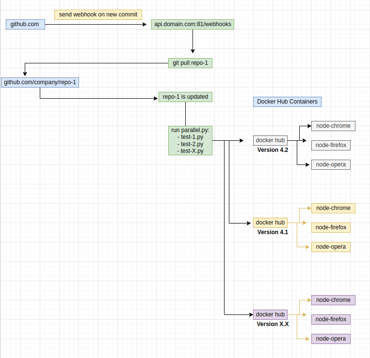

# selenium-tools
Python 3 package based on Selenium 4 for easy creation and running of parallel QA tests.

**Notice: This project is still in Beta version**!

### Features
* reusable code without repeating code and hardcoded variables inside
* custom error messaging system. sending QA reports
* parallel or synchronously testing with selenium docker hub and node containers
* screenshot generation on test error
* JavaScript console log checking for error on each test steps
* easy visual debugging on CSS/XPATH selectors
* github webhooks integration
* Dashboard for all important metrics and software version related with tests
* ENV dump script for virtual machines
* python package fetching information from Local SMT server - MailHog [github.com/mailhog](https://github.com/mailhog/MailHog)
* regular web speed load performance tests for list oh websites
* check assets test - missing CSS,JS, image resources during page loading
* automatic check and downloading for new webdriver on docker containers versions 

### Diagrams
all diagram are located in folder: diagrams and to open it you must use 
[https://www.diagrams.net/](https://www.diagrams.net/) or plugin for code editor like this [Draw.io into VS Code](https://marketplace.visualstudio.com/items?itemName=hediet.vscode-drawio)

